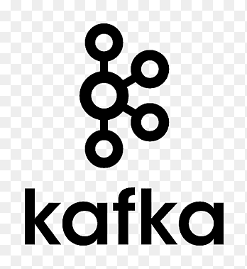
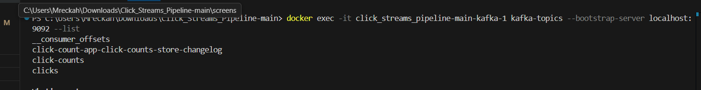
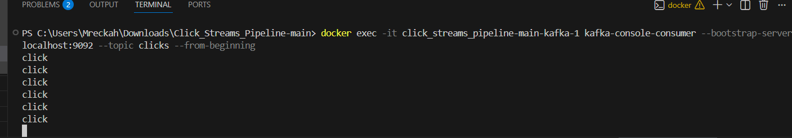
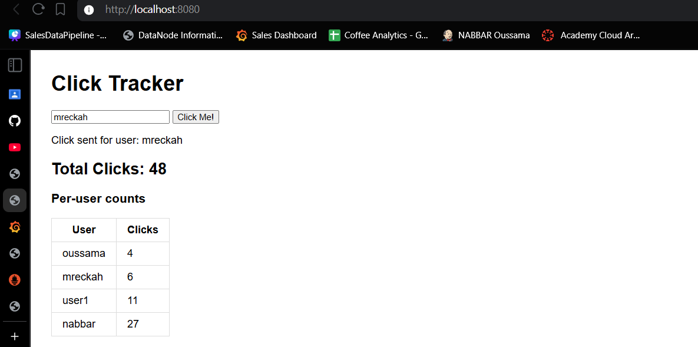
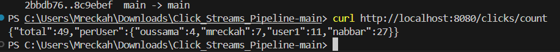
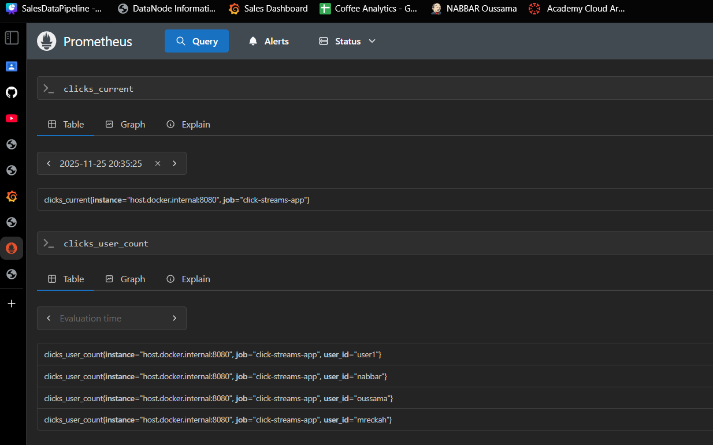
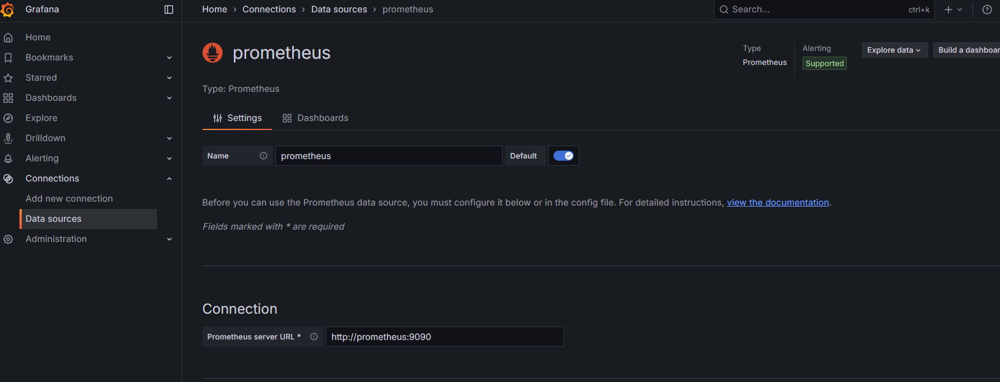
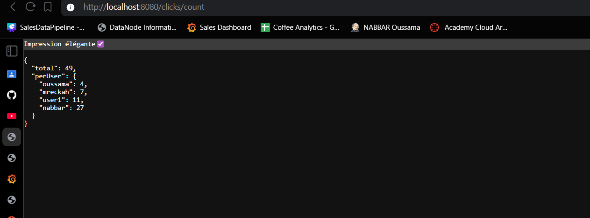

# Click Streams Pipeline – Real-Time Click Counter

This project implements a Kafka Streams application that counts user clicks in real time using Spring Boot, with Prometheus metrics and Grafana visualization.

<div align="center">
  
</div>

---

## Topics to create

- `clicks` – input topic (user clicks)
- `click-counts` – output topic (aggregated click counts)




---

## Web Producer

- Web interface with a button **"Cliquez ici"**.
- Each click sends a Kafka message to the `clicks` topic:
  - Key = `userId`
  - Value = `"click"`



---

## REST Consumer

- Consumes `click-counts` topic.
- Exposes a REST API endpoint:

```
GET /clicks/count
```

- Returns real-time total click count.



---

## Prometheus Metrics

The application exposes Prometheus metrics at `/actuator/prometheus`:

### Available Metrics:

- `clicks_current` - Current total clicks
- `clicks_total` - Total clicks counter
- `clicks_unique_users` - Number of unique users
- `clicks_user_count{user_id="..."}` - Clicks per user

### View Metrics in Prometheus:

1. Start Prometheus: `docker compose up -d prometheus`
2. Open **http://localhost:9090**
3. Query examples:
   - `clicks_current` - See current total clicks
   - `rate(clicks_total[5m])` - Clicks per second
   - `clicks_user_count` - Clicks per user



---

## Grafana Dashboard

Visualize click data in real-time with Grafana:

### Setup:

1. Start Grafana: `docker compose up -d grafana`
2. Open **http://localhost:3000**
3. Login: `admin` / `admin`
4. Add Prometheus data source:
   - Settings → Data sources → Add data source
   - Select **Prometheus**
   - URL: `http://prometheus:9090`
   - Save & Test
   


### Create Dashboard:

Query: `clicks_current` for total clicks
Query: `clicks_user_count` for per-user clicks


---

### Total Clicks



---

## Conclusion

- Demonstrates Kafka Streams for real-time click aggregation.
- Integrates Spring Boot Web, Kafka Streams, and REST API.
- Shows event-driven architecture with Kafka topics for processing.
- Includes Prometheus metrics and Grafana visualization for monitoring user clicks.
