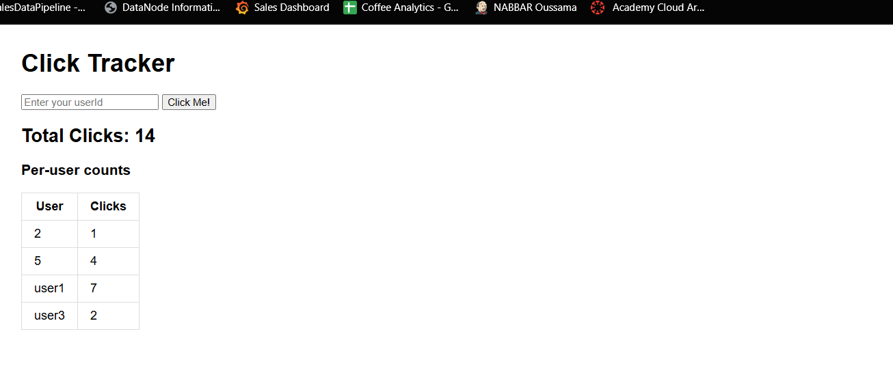
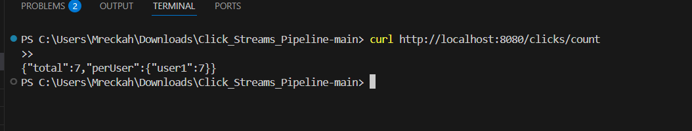
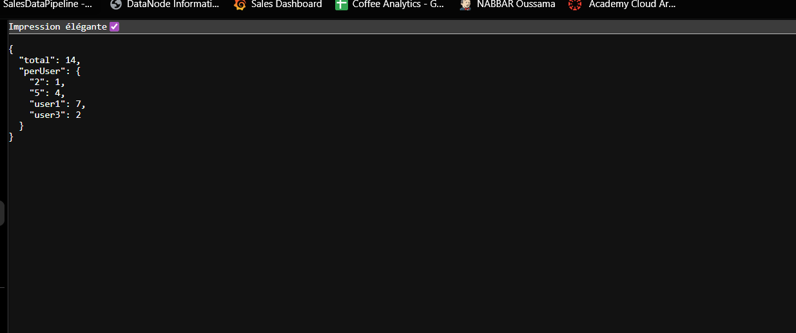

# Click Streams Pipeline – Real-Time Click Counter
This project implements a Kafka Streams application that counts user clicks in real time using Spring Boot.

<div align="center">
  
</div>

---

## Topics to create

* `clicks` – input topic (user clicks)  
* `click-counts` – output topic (aggregated click counts)


---

## Web Producer

* Web interface with a button **"Cliquez ici"**.  
* Each click sends a Kafka message to the `clicks` topic:  
  - Key = `userId`  
  - Value = `"click"`  



---
## REST Consumer

* Consumes `click-counts` topic.  
* Exposes a REST API endpoint:  
```

GET /clicks/count

```
* Returns real-time total click count.



---

## Test Flow

1. Start Kafka and Zookeeper via Docker Compose.  
2. Start `click-producer` and click the button in the browser.  
3. Start `click-streams` to process clicks in real time.  
4. Start `click-consumer` and check total clicks via API:  
```

[http://localhost:8080/clicks/count](http://localhost:8080/clicks/count)

```
### Total Clicks


---

## Conclusion

* Demonstrates Kafka Streams for real-time click aggregation.  
* Integrates Spring Boot Web, Kafka Streams, and REST API.  
* Shows event-driven architecture with Kafka topics for processing.  
```