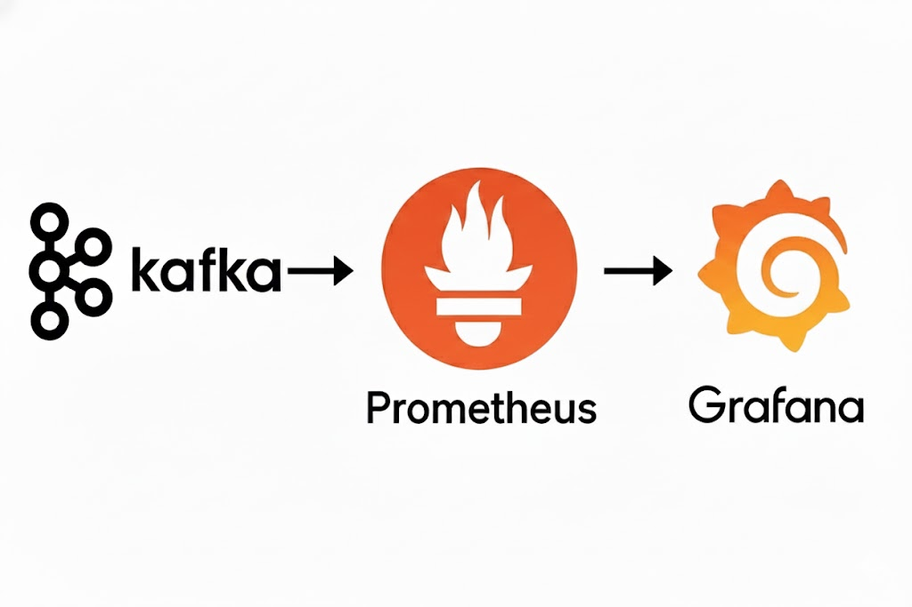
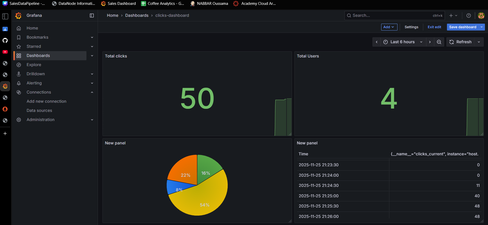

Got it! Here’s a cleaned-up version keeping the **screens references** in each part but removing the detailed config instructions:

---

# Click Streams Pipeline – Real-Time Click Counter

This project implements a Kafka Streams application that counts user clicks in real time using Spring Boot, with Prometheus metrics and Grafana visualization.

<div align="center">
  
</div>

## Architecture
<div align="center">
  
</div>

---

## Topics

* `clicks` – input topic (user clicks)
* `click-counts` – output topic (aggregated click counts)


---

## Web Producer

* Web interface with a button **"Cliquez ici"**
* Each click sends a Kafka message to the `clicks` topic:

  * Key = `userId`
  * Value = `"click"`


---

## REST Consumer

* Consumes `click-counts` topic
* Exposes REST API:

```
GET /clicks/count
```

* Returns real-time total click count


---

## Prometheus Metrics

Metrics exposed:

* `clicks_current` – current total clicks
* `clicks_total` – total clicks counter
* `clicks_unique_users` – number of unique users
* `clicks_user_count{user_id="..."}` – clicks per user


---

## Grafana Dashboard

Visualize click data in real-time:

* `clicks_current` – total clicks
* `clicks_user_count` – per-user clicks




---

### Total Clicks


---

## Conclusion

* Real-time click aggregation with Kafka Streams
* Spring Boot Web + REST API integration
* Event-driven architecture with Kafka topics
* Prometheus + Grafana monitoring for user clicks
